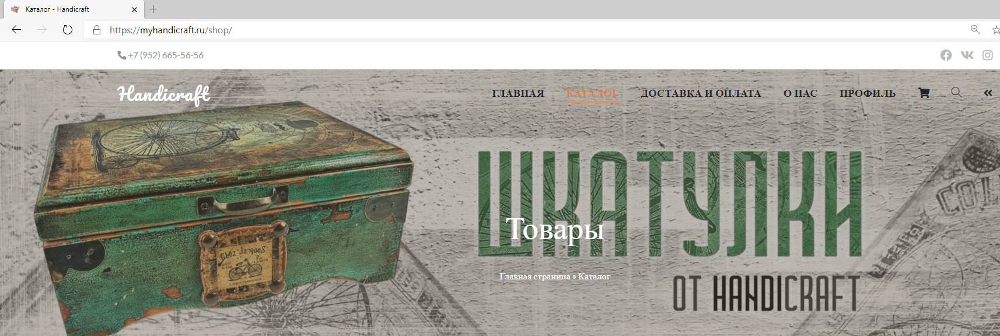

# Требования к изображениям

## Общие положения.

Изображения необходимы для оформления [сайта](http://myhandicraft.ru).

## Изображения для сайта

### Слайдер/баннер

Изображение для отображения в верхней части [сайта](http://myhandicraft.ru) на всех страницах кроме главной. 
Изображение должно олицетворять тематику магазина - это изделия, подарки ручной работы: шкатулки, ключницы, подставки под телефоны, браслеты и т. д.  

Пропорции изображений 1400x400 Фон светлый. Итоговый размер изображения должен быть не меньше 2800x800.

Изображение представляет собой собирательный образ магазина изделий ручной работы Handicraft. 
В качестве главной темы можно использовать изображение шкатулки Сирень: 

 Так же для формирования образа можно использовать как фотографии товаров из технических заданий к [шкатулкам](requirements_box.md), [ключницам](requirments_housekeepers.md), [браслетам](requirments_bracelets.md), так и [работы из архива](art.zip).

### Текст: Handicraft

Пропорции изображений 1400x400. Итоговый размер изображения должен быть не меньше 2800x800. 

В верхней части баннера должен хорошо читаться текст в цветах  #262626, #d89568, #d88045, #000000. 
В центральной части баннера по всей ширине должен хоршо читаться текст в цветах #d89568, #ffffff.

#### Пример расположения текста

