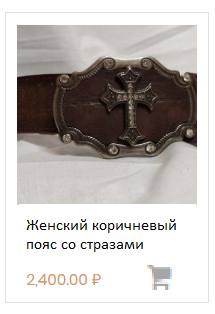

## Список требований к сайту
### Оглавление
[Общие положнеия](#common-terms)
[Функциональность](#fetures)
- [Заголовок](#header)
- [Главное меню](#main-menu)
- [Главная страница](#main-page)
- [Cтраница каталога](#catalog)
  - [Меню каталога](#catalog-menu)
  - [Хлебные крошки](#bread-crumbs)
  - [Сетка твоаров](#goods-grid) 
  - [Карточка товара](#good-view)
- [Недавно просмотренные товары](#recent-goods)
[Товары](#goods)
- [Категории товаров](#categories)
- [Фильры](#filters)
- [Корзина](#cart)  
[Дизайн](#design)  

<a name="common-terms"><h3>Общие положнеия</h3></a>
Сайт предназначен для торговли различными товарами. Преимущество изделиями ручной работы из дерева и кожи, но не ограничен этим.

Интрефейс сайта должен быть интуитивно понятен и привычен пользователю.

Основные элементы управления должны распологаться на привычных пользователю местах. 
Для этого стоит ориентироваться на положения Material Design, решения примененные крупнвми интернет магазинами такими как Ozon, Amazon, Wildberries и т. п., обсуждать решения со мной. 

Язык интерфейса: Русский (полностью).

Сайт должен быть документирован в мере достаточной для эксплуатации человеком, столкнувшимся с ним в первый раз. Это означает, что документации достаточно, чтоб:
- добавить/изменить товар и привязать его к категориям
- создать категорию
- промодерировать отзыв
- изменить контактыне данные/способы оплаты/условия доставки
- Изменить рекламные материалы на карусели на главной странице

Уведомления о заказах, отзывах и обратных звонках должны поступать на email order@myhandicraft.ru

Сайт должен корректно отображаться как в мобильной так и в десктопной версии

<a name="fetures"><h3>Функциональность</h3></a>
<a name="header"><h4>Заголовок</h4></a>
Заголовок находится в верхней части страницы, содержит автар, текст _Хэндикрафт_, строку поиска, кнопку [корзины](#cart), телефон для связи _+7(952)665-56-56_ и кнопку обратный звонок.
<a name="main-menu"><h4>Главное меню</h4></a>
Состоит из следующих пунктов:
- [Главная страница](#main-page)
- [Каталог](#catalog)
- [Доставка и Оплата](#ship-n-pay)
- [Профиль](#profile)
- [Статус заказа](#view-order)
- [О нас](#about)

<a name="main-page"><h4>Главная страница</h4></a>
Предназначена для отображения 
- ркламных материалов (Мастера, коллекции) 
- новых потуплений.

В верхней части страницы карусель с рекалмными материалами
в центре [сетка товаров](#goods-grid) на большую часть страницы.

<a name="catalog"><h4>Страница каталога</h4></a>
Предназначена для навигации по каталогу с помощью [категорий](#categories) и [фильтров](#filters), а так же хлебных крошек (breadcrumbs).
В левой части страницы [меню каталога](#catalog-menu) (второстепенное меню)
В правой части содержит:
- главную страницу каталога с крупными изображениями, соответствующим [категориям](#categories), осуществляющим навигацию на соответсвующий пункт [меню каталога](#catalog-menu)
- при навигации отображается [сетка товаров](#goods-grid), отфильтрованаю соответсвующим образом. 

_При отображении [сетки товаров](#goods-grid) должны отображаться [хлебные крошки](#bread-crumbs) в верхней части страницы._

<a name="catalog-menu"><h5>Меню каталога</h5></a>
Осуществляет навигацию по [категориям](#categories) и [фильтрам](#filters) (где применимо). Категории по группам должны иметь **неинтерактивный** заголовок.
Навигация по пунктам меню каталога открывает в правой части [сетку товаров](#goods-grid), отфильтрованую соответсвующим образом.  
<a name="bread-crumbs"><h5>Хлебные крошки</h5></a>
Хлебные крошки отображуются в сетке товаров и карточке товара. Навигация по похожим товарам должнв отражаться в хебных крошках.
<a name="goods-grid"><h5>Сетка товаров</h5></a>
Сетка товаров отображает таблицу товаров отфильтрованых по признаку (новинки|женские пояса и т. п.), предоставляет возможности сортировки.
<a name="good-view"><h5>Карточка товара</h5></a>
Карточка товара с кратким/подробным описанием. Озывыв не нужны т.к. товар штучный и после продажи карточка перестает быть доступна другим пользователям. 

При наведении на карточку в [сетке товаров](#goods-grid) картинки должы сменяться с интервалом 3 секунды.

<a name="catalog"><h4>Доставка и оплата</h4></a>
Возможны следующие опции доставки:
- Доставка по СПБ в пределах КАД 350 р.
- Доставка почтой CDEK по тарифу транспортной компании (предоплата)
- Доставка почтой России (предоплата)

Опции оплаты
- Наличные при доставке по СПб в пределах КАД
- Банковской картой на сайте.

Реквизиты на которые должен осуществляться перевод   
Валюта получаемого перевода: Рубли (RUB)  
Получатель: АНТИПЕНКО ДЕНИС НИКОЛАЕВИЧ  
Номер счёта: 40817810055869515283  
Банк получателя: СЕВЕРО-ЗАПАДНЫЙ БАНК ПАО СБЕРБАНК  
БИК: 044030653  
Корр. счёт: 30101810500000000653 
ИНН: 7707083893  
КПП: 784243001  
SWIFT-код: SABRRUMM  
**В коментариях к платежу нужно добавлять в начало "Перевод личных средств не облагается НДС"**

<a name="profile"><h4>Профиль</h4></a>
В профиле у польователя должны быть
- Текущие заказы со статусом
- История заказов 
- Контактные данные/адрес доставки по-умолчанию
- Возможность сменить почтовый адресс

<a name="view-order"><h4>Статус заказа</h4></a>
Позволяет посмотреть статус заказа по номеру. Номер заказа передается в url http запроса таким образом, чтоб ссылку на статус заказа можно было сохранить.

<a name="about"><h4>О Нас</h4></a>
Страница с информацией об организации и отзывами.

Отзывы не должны требовать обязательного указания Email. Если Email используется для нотификаций о дискусии, об этом нужно предупреждать. Но нужно остаить возможность не заполнять поле.

<a name="recent-goods"><h4>Недавно просмотренные товары</h4></a>
Внизу страницы над футером распологаются недавно просмотренные товары - одна строка карточек товара меньшего размера.
Отображается на всех страницах, кроме корзины. 

<a name="goods"><h3>Товары</h3></a>
<a name="categories"><h4>Категории</h4></a>
Это типовые признаки товара.
Категории так же групируются по одному обобщающему признаку.
В настоящий момент существуют следующии категории по группам:
- Интерьер
  - Шкатулки
  - Ключницы
- Аксесуары
  - Браслеты
  - Ремни
  - Кошельки
- Сумки
  - Рюкзаки
  - Сумки
- Мастера
  - Феликс Родионов
  - Наталья Прокопчук
  
Необходимо обеспечить возможность конфигурирования категорий.
<a name="filters"><h4>Фильтры</h4></a>
Это второстепенные признаки товара.
Необзодимо завести следующие фильтры:
- Цена:  
Применим ко всем категориям.
- Пол (мужской|женский)  
Применим к категориям Аксесуары и Сумки.

<a name="cart"><h4>Корзина</h4></a>
Позволяет оформить заказ.
- Возможность зарегистрироваться и оформить заказ.
- Возможность оформить заказ без регистрации.

После оформления заказа отоборажается страница с номером и статусом заказа.
<a name="design"><h3>Дизайн</h3></a>
Первый ориентир по дизайну каталога.

Первый ориентир по дизайну главной страницы.

Первый ориентир по дизайну карточки товара.

